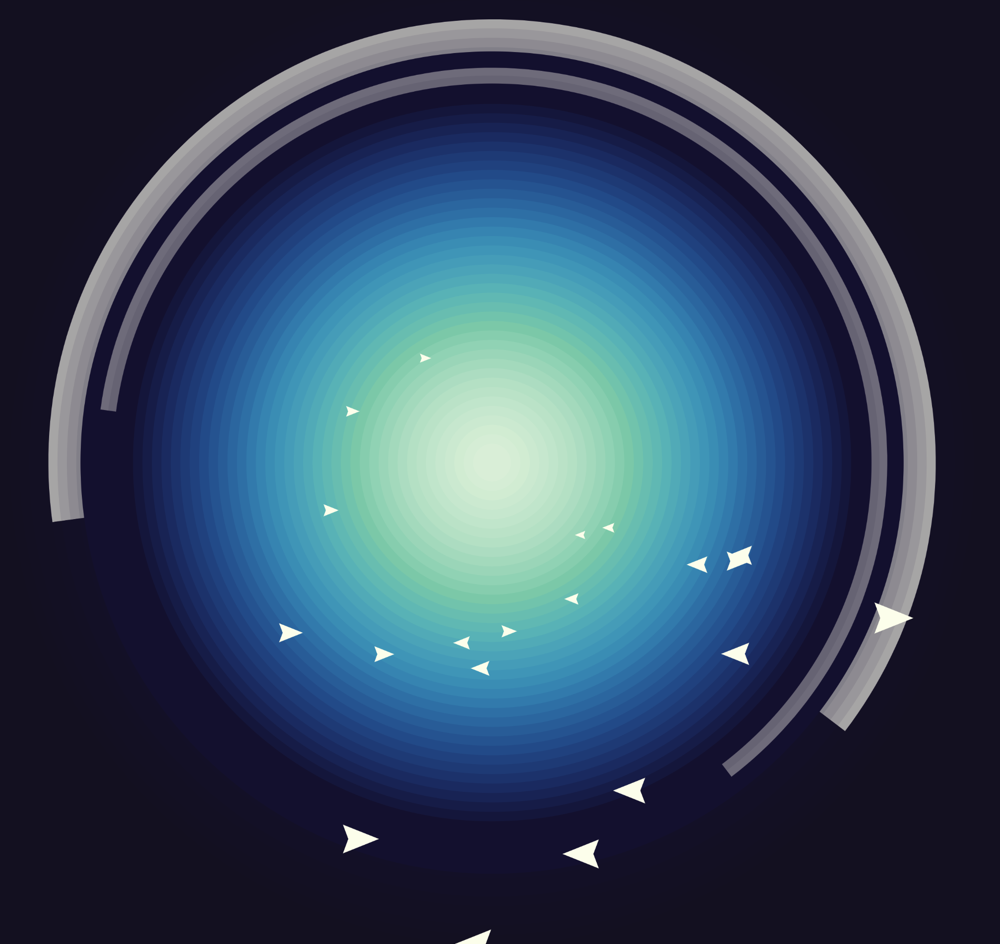
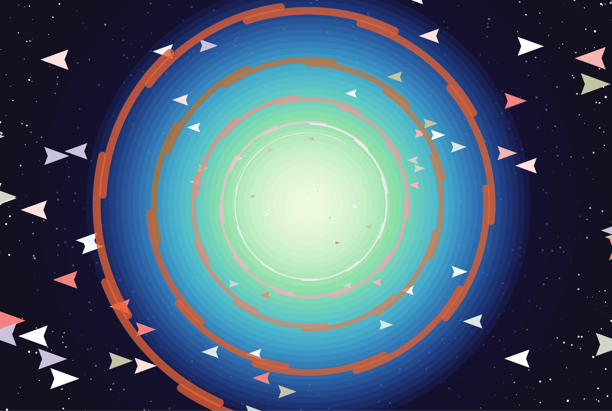
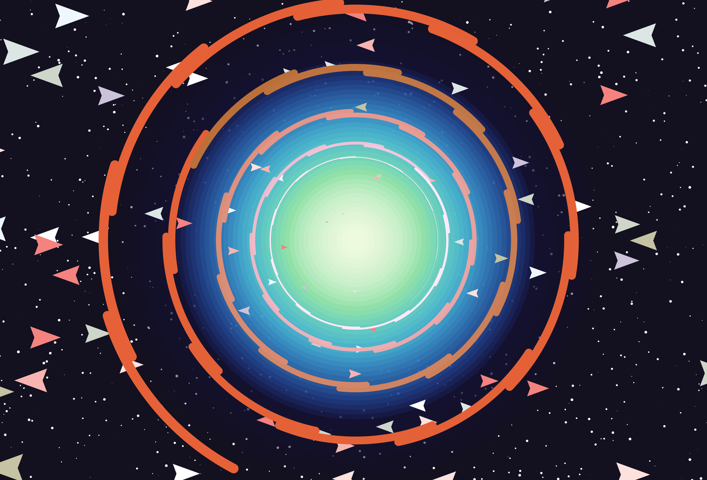
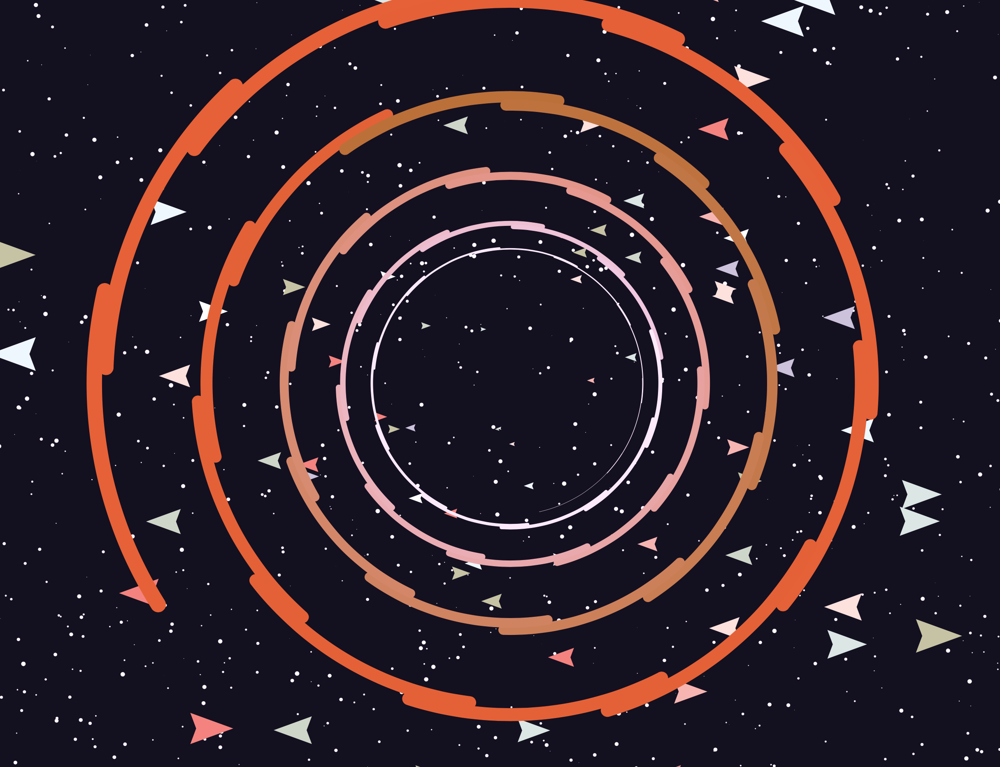
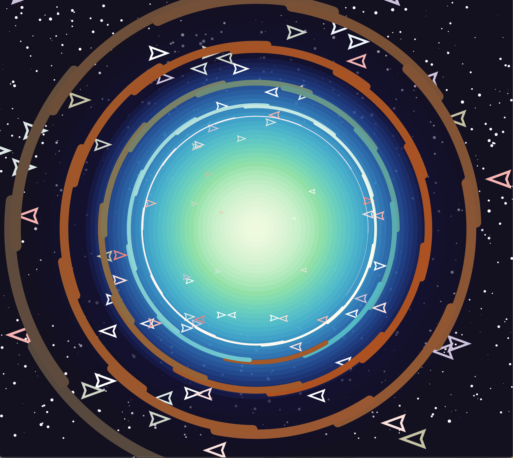

# FORM + CODE

I created a smoll galaxy. Looking through Code Pen, I was very inspired by one work
by ScieCode. Here is a link to the pen https://codepen.io/sciecode/pen/QzMPgr
The code from the above artist is used in 'backgroundAura'

 
This every changing portal in this galaxy regenerates every time you refresh. 
The triangle spaceships swim around in anti-gravity. 
They slow down and become smaller as they float 'further away'. With this piece, 
I was mainly playing around with how scale and speed can alter a person's perspective of a 2D animation. 

 
Detail I hope people notice ^-^/

<ul>
  <li>Stars flicker!</li>
  <li>Spaceships flicker pastel colours</li>
  <li>The ships become smaller and slower as they fly down into the portal</li>
  <li>After a while, many of this ships get "trapped" in the portal
  <li>Portal Gates Spiral down in gradient colours</li>
</ul>

Hope you enjoy!

Below are progress shots!
 

Image without background portal!
 

Final Image!!
 
